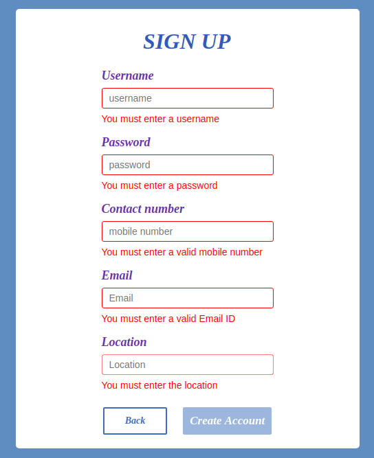
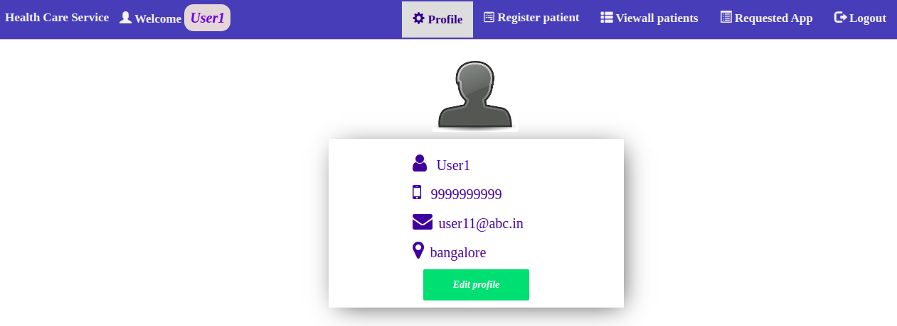
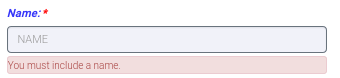
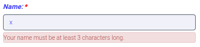
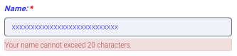
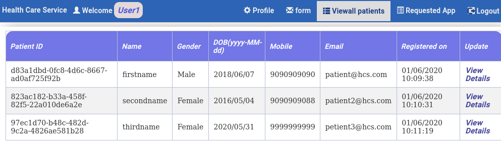
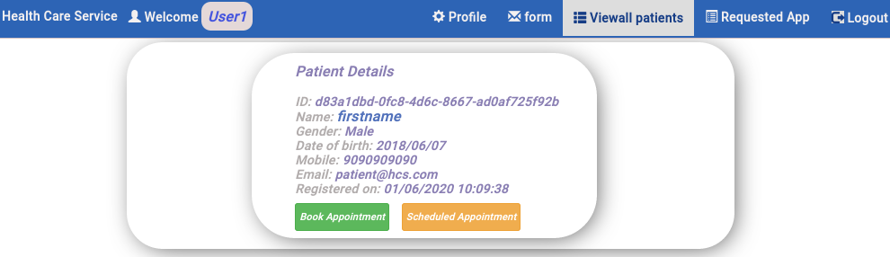
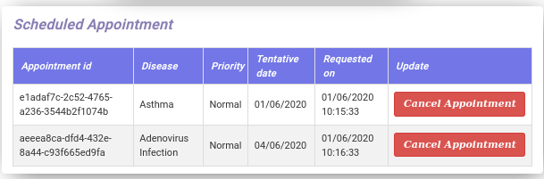
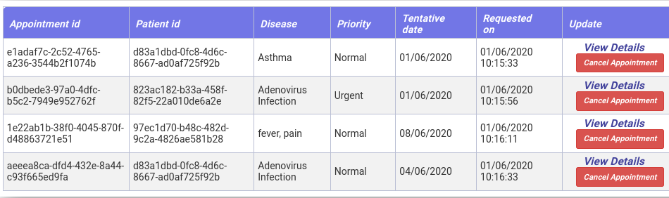

Create an application <strong>Healthcare Service</strong> that can be used by the receptionist of a hospital to
    register patients and book/cancel appointments.

 

 

<strong>SpringBoot</strong>

 

Create an API for Healthcare Service.

 

<strong>API Endpoints</strong>

<strong>register:(HTTP METHOD-POST)</strong>

<ul>
    <li>Should register a user.</li>
    <li>On
        successful registration, the response should be {message=""Registration successful""}.</li>
    <li>On
        registration failure, the response should be {message="Password or username policy failed"}.</li>
</ul>

 

<strong>signin</strong> : <strong>(HTTP METHOD-POST)</strong>

<ul>
    <li>A user should be able to
        sign in through this endpoint by providing their <strong>email</strong> and <strong>password</strong>.</li>
    <li>On successful login, the response should be: { message = "Authentication successful!",</li>
</ul>

 token = <strong>JWTtoken</strong>,

 id=user.Id};

<ul>
    <li>On login failure, the response should
        be {message="Username or Password is Incorrect."}</li>
</ul>

 

    <strong>"viewprofile/{userId}":(HTTP METHOD-GET)</strong>

Should return the details of all users.

 

<strong>"editprofile/{userId}":(HTTP METHOD-GET)</strong>

Should allow you to edit a
    user's profile.

 

<strong>"patients/register" : (HTTP METHOD-POST)</strong>

<ul>
    <li>A user should be able to register a patient through this API.</li>
    <li>On succcessful registration, the
        response should be {message="Registration successful"}. </li>
    <li>On registration failure, the response
        should be {message="Registration failure"}.</li>
</ul>

 

<strong>"patients/list/": (HTTP
        METHOD-GET)</strong>

Should return the list of all patients.

 

    <strong>"patients/view/{Id}" : (HTTP METHOD-GET)</strong>

Should return details of a specified patient
    ID.

 

<strong>"patients/delete/{Id}" : (HTTP METHOD-DELETE)</strong>

Should delete a
    specified patient ID.

 

<strong>"appointment/register" : (HTTP METHOD-POST)</strong>

<ul>
    <li>Should book an appointment.</li>
    <li>On successful booking, the response should be {message="Booking
        successful"}.</li>
    <li>On booking failure, the response should be {message="Booking failure"}.</li>
</ul>

 

<strong>"appointment/list" : (HTTP METHOD-GET)</strong>

Should return the list of all
    appointments.

 

<strong>"/appointment/view/{appointmentId}":(HTTP METHOD-GET)</strong>

Should return details of a specified appointment ID.

 

<strong>"/appointment/list/{patientid}"
        : (HTTP METHOD-GET)</strong>

Should return the list of all the appointments of a specified patient ID.

 

<strong>"/appointment/delete/{appointmentId}" : (HTTP METHOD-DELETE)</strong>

Should
    delete a specified appointment ID.

 

<strong>Middleware:</strong>

Create a Middleware
    to validate the API calls using JSON web token (JWT).

<ul>
    <li>'Sign in' and 'Register API' endpoints do
        not require Middleware.</li>
    <li>If the login details are validated, send a response with the JWT as token
        parameter.</li>
</ul>

 

<strong>Steps:</strong>

1. Install dependencies (project &gt;
    install)

2. Run application (project &gt; run)

3. Test application (Run tests)

 

 

<strong>Angular:</strong>

 

<strong>Application Overview</strong>

 

Screens in the application:

 

<ul>
    <li>Login</li>
    <li>Profile</li>
    <li>Register patient
    </li>
    <li>Viewall Patients</li>
    <li>Requested App</li>
</ul>

 

<strong>Sign Up</strong>

 

<table height="923" width="896">
    <tbody>
        <tr>
            <td>
                <ul>
                    <li>The form
                        must contain the fields <strong>Username</strong>, <strong>Password</strong>, <strong>Contact
                            number</strong>, <strong>Email</strong>, and <strong>Location</strong>.</li>
                    <li>
                        <strong>Contact number</strong> should be exactly 10 digits and <strong>Email</strong> should
                        be a valid email ID. Error messages must be displayed for invalid inputs.
                    </li>
                    <li>
                        
The <strong>Create Account</strong> button should be enabled only if all the fields
                            pass the required validations.

                    </li>
                </ul>
            </td>
            <td></td>
        </tr>
        <tr>
            <td>
                <ul>
                    <li>The
                        <strong>Username</strong> should be a minimum of 3 characters, and the <strong>Password</strong>
                        should be a minimum of 8 characters.
                    </li>
                    <li><strong>Password Pattern</strong>:
                        Should contain at least one upper case letter, one lower case letter, one numeric digit, and one
                        special character. The allowed special characters are !$%@#£€*?&amp;.
                         <strong>Example</strong>: pasSword8#
                    </li>
                    <li>Error messages must be
                        displayed for invalid inputs.</li>
                </ul>
            </td>
            <td></td>
        </tr>
        <tr>
            <td>
                <ul>
                    <li>The
                        <strong>Username</strong> and <strong>Password</strong> should not exceed 20 characters.
                    </li>
                    <li>Error messages must be displayed for invalid inputs.</li>
                </ul>
            </td>
            <td></td>
        </tr>
    </tbody>
</table>

 

 

    <strong>Login</strong>

 

<table height="820" width="898">
    <tbody>
        <tr>
            <td>
                <ul>
                    <li>The <strong>LOGIN</strong> page must contain <strong>Username</strong> and
                        <strong>Password</strong> fields, and a <strong>Login</strong> button.
                    </li>
                    <li>If
                        there are no inputs in the <strong>Username/Password</strong> fields, an error message must be
                        displayed.</li>
                    <li>The <strong>Login</strong> button should be enabled only if all the
                        fields pass the required validations.</li>
                </ul>
            </td>
            <td></td>
        </tr>
        <tr>
            <td>
                <ul>
                    <li>The
                        <strong>Username</strong> should be a minimum of 3
                            characters, and the <strong>Password</strong> should be a minimum of 8 characters.
                    </li>
                    <li><strong>Password
                            Pattern</strong>: Should contain at least one upper case letter, one lower case letter, one
                        numeric digit, and one special character. The allowed special characters are !$%@#£€*?&amp;.
                         <strong>Example</strong>: pasSword8#</li>
                    <li>Error messages must be
                        displayed for invalid inputs.</li>
                </ul>
            </td>
            <td></td>
        </tr>
        <tr>
            <td>
                <ul>
                    <li>The
                        <strong>Username</strong> and <strong>Password</strong> should not exceed 20 characters.
                    </li>
                    <li>Error messages must be
                        displayed for invalid inputs.</li>
                </ul>
            </td>
            <td></td>
        </tr>
    </tbody>
</table>

 

 

    <strong>Profile</strong>

 

<table height="890" width="904">
    <tbody>
        <tr>
            <td>
                <ul>
                    <li>The <strong>Profile</strong> page must contain a user profile section (Name,
                        Contact number, Email, and Location) with an <strong>Edit profile</strong> button.</li>
                    <li>A user should be able to edit their profile details in the form that appears when the
                        <strong>Edit profile</strong> button is clicked.
                    </li>
                </ul>
            </td>
            <td>
            </td>
        </tr>
        <tr>
            <td>
                <ul>
                    <li>A user should be able
                        to edit all details except <strong>Name</strong> (disabled).</li>
                    <li><strong>Contact
                            number</strong> should be exactly 10 digits and <strong>Email</strong> should be a valid
                        email ID. Error messages must be displayed for invalid inputs.</li>
                    <li>When the user
                        successfully submits the updates, the changes must be displayed.</li>
                    <li>When the
                        <strong>Discard</strong> button is clicked, the form must be hidden.
                    </li>
                </ul>
            </td>
            <td></td>
        </tr>
        <tr>
            <td>
                <ul>
                    <li>None of the input
                        fields should be empty.</li>
                    <li>The <strong>Make changes</strong> button should be
                        enabled only if all the fields pass the required validations.</li>
                </ul>
            </td>
            <td>
            </td>
        </tr>
    </tbody>
</table>

 

 

<strong>Register
        Patient</strong>

 

<table height="634" width="910">
    <tbody>
        <tr>
            <td>
                <ul>
                    <li>
                        
The fields marked * are mandatory.

                    </li>
                    <li>
                        
The <strong>Submit</strong> button should be enabled only after the user has
                            entered details in all the mandatory fields. 

                    </li>
                    <li>
                        

                            On submitting the registration form, the user should be redirected to the <strong>View all
                                patients </strong>page where the list of all the patients should be displayed.

                    </li>
                </ul>
            </td>
            <td>
            </td>
        </tr>
        <tr>
            <td>
                <ul>
                    <li><strong>Name</strong> should be a minimum
                        of 3 characters and a maximum of 20 characters, and should not be empty.</li>
                    <li>
                        <strong>Gender</strong> should not be empty.
                    </li>
                    <li><strong>DOB</strong> should
                        not be empty.</li>
                    <li><strong>Mobile</strong> should be exactly 10 digits and should
                        not be empty.</li>
                    <li><strong>Email </strong>should be a valid email.</li>
                    <li>Error messages must be displayed for invalid inputs.</li>
                </ul>
            </td>
            <td>
                

                

                

                

                
 

            </td>
        </tr>
    </tbody>
</table>

 

 

    <strong>View all Patients</strong>

 

<table height="926" width="914">
    <tbody>
        <tr>
            <td>
                <ul>
                    <li>
                        
Should display all the registered patients.

                    </li>
                </ul>
            </td>
            <td>
            </td>
        </tr>
        <tr>
            <td>
                
 

                <ul>
                    <li>
                        
On clicking
                            <strong>View Details</strong>, details of the selected patient should be displayed.
                        

                    </li>
                </ul>
            </td>
            <td>
                

                

                
 

                
 

            </td>
        </tr>
        <tr>
            <td>
                <ul>
                    <li>
                        
On clicking the <strong>Book Appointment</strong> button, the
                            <strong>Book Appointment</strong> form should be displayed.
                        

                    </li>
                    <li>
                        
The fields marked * are mandatory.

                    </li>
                    <li>
                        
The
                            <strong>Schedule</strong> button should be enabled only after the user has entered details
                            in all the mandatory fields.
                        

                    </li>
                    <li>
                        
After booking an
                            appointment, the user should be redirected to the <strong>Requested Appointments</strong>
                            page where all the appointments should be displayed.

                    </li>
                </ul>
            </td>
            <td>
            </td>
        </tr>
        <tr>
            <td>
                <ul>
                    <li>
                        
The <strong>Scheduled
                                Appointments</strong> table should be displayed when the <strong>Scheduled
                                Appointments</strong> button is clicked.

                    </li>
                    <li>
                        

                            The table should display all the appointments of the selected patient.

                    </li>
                    <li>
                        
On clicking the <strong>Cancel Appointment</strong> button, the
                            appointment should be deleted.

                    </li>
                </ul>
            </td>
            <td></td>
        </tr>
        <tr>
            <td>
                
 

                <ul>
                    <li>
                        
Display an appropriate message if there is no appointment.

                    </li>
                </ul>
            </td>
            <td></td>
        </tr>
    </tbody>
</table>

 

<strong>Requested
        Appointments</strong>

 

<table height="197" width="926">
    <tbody>
        <tr>
            <td>
                <ul>
                    <li>
                        
Should display the booked appointments of all the patients.

                    </li>
                    <li>
                        
On clicking <strong>View Details</strong>, details of
                            the selected patient should be displayed.

                    </li>
                    <li>
                        
On
                            clicking the <strong>Cancel Appointment</strong> button, the appointment should be deleted.
                        

                    </li>
                </ul>
            </td>
            <td>
            </td>
        </tr>
    </tbody>
</table>

 

<h4><strong>Header</strong></h4>

 

<table align="left" height="243" width="1018">
    <tbody>
        <tr>
            <td>
                <ul>
                    <li>The header
                        component should be displayed at the top of all pages except the <strong>Login</strong> page.
                    </li>
                    <li>The header component should display the name of the logged in user.</li>
                    <li>Clicking on a particular menu should navigate to the corresponding page.</li>
                </ul>
                
 

            </td>
            <td>
                
 

                

                

            </td>
        </tr>
    </tbody>
</table>

 

<h2> </h2>

 

 

 

 

<h4> </h4>
<h4> </h4>
<h4> </h4>
<h4> </h4>
<h4><strong>Services</strong></h4>

 

Services in the application:

 

<ul>
    <li><strong>API</strong><strong>
            Service</strong> Service for API calls to the backend server.</li>
    <li><strong>Auth
            Guard</strong> To prevent navigation to the application pages other than the login page for
        unauthorized users.</li>
    <li><strong>Data Service</strong> Acts as middleware between a component
        and API service.</li>
</ul>

 

<h2><strong>Other Instructions</strong></h2>

 

<ul>
    <li>All the project files should be kept in the <strong>src</strong> folder.</li>
    <li><em><strong>Do not modify
                the ids or classes</strong></em> of the existing UI elements as they are required by the unit tests.
    </li>
    <li>The API URL is predefined in the service as <strong>API_URL</strong>. You can use <strong>API_URL +
            endpoint</strong> as required.</li>
</ul>"