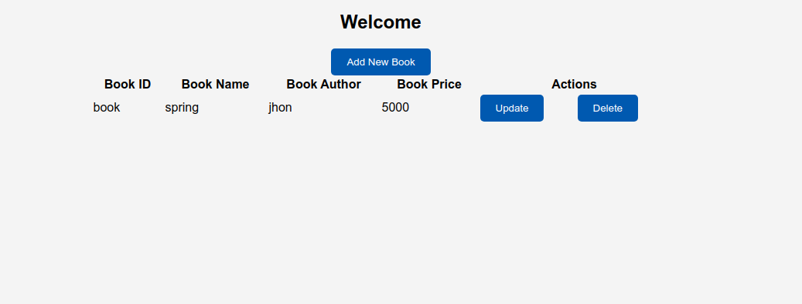
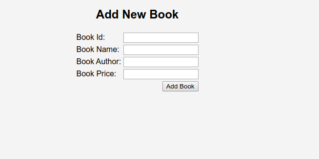
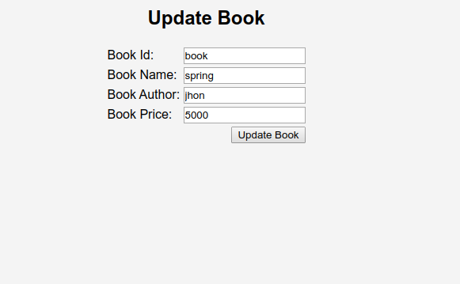

Build a basic Book Management MVC application using Struts 2 and Embedded Database (H2).

Configure struts.xml with the following routes, and the JSP pages with the necessary elements, and integrate them with the required action routes.

 

<strong>Routes</strong>

<strong>"/dbInitialize"</strong>

The DBAction class should be initiated by "/dbInitialize", and should redirect to Login.jsp when the result is successful. The DBAction class will create the required tables and a user record (username="admin" , password="admin"), which is used across the application. It also inserts a book record.

 

<strong>                                               Login.jsp</strong>

 

<strong>"login"</strong>

The "login" route invokes the LoginAction. It checks if the credentials provided are valid. If the credentials are valid, it will redirect to "booksAction". Else, it will remain in the same JSP page.

                                                                                                    

<strong>                                                                                                       Books.jsp</strong>

 

 

The <strong>AddBook</strong> button should redirect to the <strong>addBook.jsp</strong> page.

The <strong>Update</strong> button should invoke "/updateDataAction" and use the book record based on bookid to return the data to the "UpdateBook.jsp" page.

The <strong>Delete</strong> button should delete the record.

 

<strong>"booksAction"</strong>

The booksAction class is invoked by the "/booksAction" route, which returns the list of all the books. Books.jsp is used to display all the records.

 

<strong>"addAction"</strong>

The addAction class is invoked by the "/addAction" route, which adds a book. On the successful addition of a book, it should redirect to "booksAction". addBook.jsp is used to display the UI to add a book.

 

                                              <strong> AddBook.jsp</strong>

 

 

The <strong>AddBook</strong> button should invoke "addAction".

 

<strong>"updateDataAction"</strong>

The updateDataAction class is invoked by "/updateDataAction". It uses the record of books based on the book ID and supplies the book parameter values to UpdateBook.jsp, which displays the existing values of the parameters.

 

                                                        <strong>updateBook.jsp</strong>

 

 

The <strong>updateBook</strong> button should invoke the "/updateAction" route, which updates a book. On a successful update, it redirects to the "booksAction" page.

The "deleteAction" route deletes the selected record, and on successful deletion, it should redirect to "booksAction".

 

<strong>Steps</strong>
<ol>\t<li><strong>Install:</strong> Project -&gt; Install</li>\t<li><strong>Run:</strong> Project -&gt; Run. On clicking the <strong>Run</strong> button, the application will run in the Tomcat server on port 8000. </li>\t<li>Append the application name"StrutsApplication", followed by the route to the link to view the UI.</li>\t<li><strong>Test:</strong> RunTests</li></ol>
